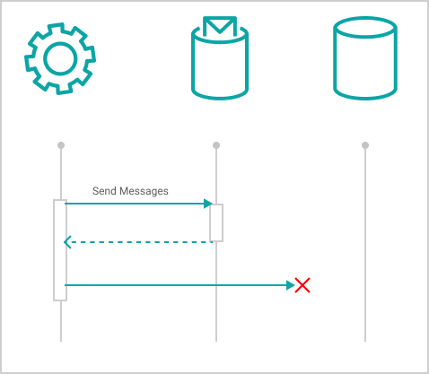
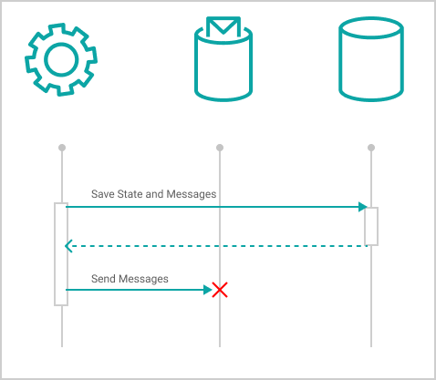
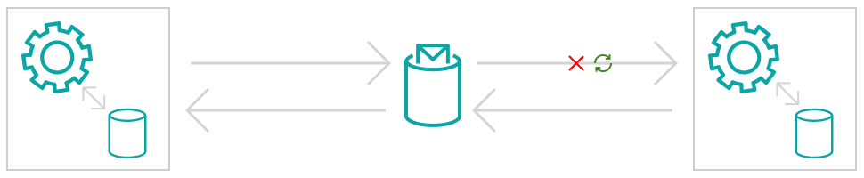
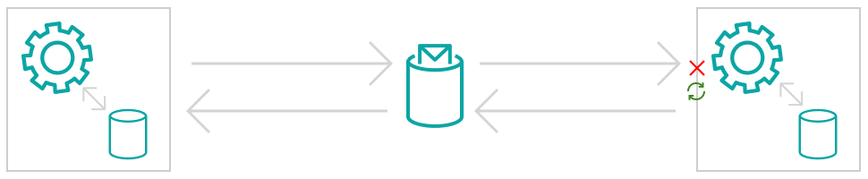
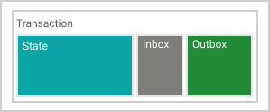

When working with a traditional database inside of a monolith application, we don't usually need to think too much about how transactions work. We can rely on a transaction to either roll back all the changes or commit them. Either way, our model is always consistent.

More recently, many applications have become distributed in one way or another. Many use a Service Bus or a REST API to communicate with other external systems. Communication between these systems is not transactional, so they won't be able to share a transaction and rollback if there are failures. So we'll need a method of reliably sending messages from one system to another. In this post, we'll be looking at how to implement reliable messaging between two applications using a Service Bus.


## What's the problem?

When sending messages over a Service Bus there are a number of failure points to consider. If there is a failure at any of these points then information could be lost, state could be corrupted or the process may stall.

>We need to do three things when processing a message
>
>1. Execute domain logic
>2. Send new messages
>3. Save updates to the database

The core of the problem lies with the fact that there are two data-stores, the primary database and a (durable) queue or topic. However, it's only possible to write to one or the other first.

### Send then Save

Let's look at what happens when we send messages first, then save to the database.



In this situation, we've sent out messages, but there was an error while writing the updated application state to the database. In this case, no updates are made to the database so as far as our application is concerned nothing happened, but we ended up leaking messages.

Now downstream systems may be working with inconsistent messages. The Service Bus may also redeliver the message, so the application can retry, but if the message is retried a different result might be reached because state and time will continue to change between attempts.

### Save then Send

So sending messages first isn't too good, what if we save first instead? Then we wouldn't process invalid messages, and we'll avoid putting bad state into the database. Let's see what that looks like.


However, now we've got a new problem. We successfully save the state but if we failed to send the messages. If we retry now, we'd risk doing the work again, creating duplicates or sending different (invalid) messages. This is a risk because the database could again be in a different state to the first attempt. In fact, the database will always be in a different state because we just wrote to it!

We could also check to make sure we haven't already handled this message and abort processing, but then no messages would be sent at all. The process would stall, and data would fail to propagate.

### Sending and Saving Atomically

What we really need is a way to do both at once. We need to store the updated state and any messages we intend to send inside a single transaction. We need this step to be atomic. If we look towards the database, we can achieve this by writing those messages to the database along with the state. In doing so, we won't leak messages before we save, and we won't lose them after either.

## Using an Outbox

Saving our state and messages inside the same transaction is the core principle of the Outbox pattern. However, there's a bit more to do before we're finished. We still need to send the messages via the Outbox.

Once the state and the messages have been persisted the next step is to *attempt* to send the messages in the Outbox. After the messages have been sent to the Service Bus we need to make a second update to the database, marking the messages as sent (dispatched).


However, there are still three separate actions being performed here, and any one of them may fail. We're safe if the first step fails because our system will still be in a consistent state. No messages are lost or leaked. However, if the second step fails, we'll still need to send those messages.



### Retry based dispatch

Unlike our earlier attempt of saving first then sending to the service bus, this time we can take advantage of our new Outbox! Now if we encounter an error, we can retry processing the message except we'll only want to send the messages we already have.

### Asynchronous dispatch

Messages that aren't redelivered after a failure, require us to also use some method of asynchronous dispatch. Either because the maximum number of tried was reached or because the message isn't configured to retry at all.  Asynchronous dispatch allows us to check for unsent messages that fall through the cracks.

### At least once delivery

After all that, we should now be in a position where a message will always be delivered to the Service Bus, *at least once*. At least once delivery is an unavoidable property of distributed messaging. Furthermore, we've been relying on it a bit already. When messages aren't successfully processed, aka there's a failure before the message is acknowledged, we depend on the message being redelivered so we can retry.

So, on the delivery side, there could be a failure to deliver a message:



A failure while processing a message:



Or a failure when sending messages a message acknowledgment, which may be lost even though the message was processed.


This means downstream services may receive messages more than once.

Next up, On the dispatch side, if multiple messages are sent, some may get through, but a failure can make it impossible to know which messages are successfully delivered. Even if the messages are dispatched one at a time, messages may still be sent multiple times due to failures.


For these reasons (and few more I don't have time for right now) it's a good idea to make message processing idempotent. Or in other words, making them safe to process multiple times. As an added optimisation, we can also store the Id's of the messages we have successfully processed and use them to drop any duplicate messages. This can help us to avoid further unnecessary processing. Then we can jump straight to sending any unsent messages.



We can refer to this as the Inbox. We also don't need to keep things in the Inbox forever. I usually opt to keep a certain window, such as Id's no longer than 30 minutes old, or the first few thousand.

### Using a relational database

We've talked a lot about a database but not what kind of database because all that matters is that the Inbox, State and the Outbox are all inside the same transaction. In a relational database, I'll usually use a separate table for the Inbox and Outbox. The Outbox will usually have the following columns:

```
- SequenceNo (Clustered Primary Key)
- MessageId
- AddedAt
- Metadata (json)
- MessageType
- Payload (json)
- Dispatched (bool)
- DeliveredAt (datetime)
```

You can also remove messages from the Outbox after they're delivered and processed if they're of no further use.

### Using a document database

You can also use the Outbox pattern with a Document database. However, it's typical for document databases not to have cross-document transactions. In this case, we can still achieve our requirement of keeping the Inbox and Outbox inside the transaction by storing them inside each document instead.

````
{
  id: "product-1",
  name: "phone (model x)",
  stockLevel: 9,
  backorderAvalible: false,
  inbox: [ "m-1", "m-2", "m4" ],
  outbox: [
    { id: "m-5", type: "QuantityReserved" ... }
  ]
}
````

Many Document Databases will let you run queries so you can find unsent messages. If you're using Azure CosmosDB the change feed is a fanatic method of subscribing to changes through the database.

## Final Notes

The real world often forces us to think about all the ways our software can fail. The Outbox presents a robust method of reliable message delivery in the face of failure. It's incredibly important to build this reliability into our systems. Otherwise, when things inevitably fail, data inconsistency and data loss will happen.

As an industry, I worry that it's all too common to see companies delay or avoid implementing reliable messaging. Instead, hoping that these failures won't happen (yet). And while some of these failures can be rare, the alternative is often much worse. When message silently go missing or messages are leaked it can quickly become a big issue. One that's often difficult to resolve.

Finally, I'd like to point out this certainly isn't the only way to tackle the problem of reliable messaging. But when it comes to messaging and a ServiceBus it's certainly an invaluable tool to have at your disposal.

Happy Outboxing.

